

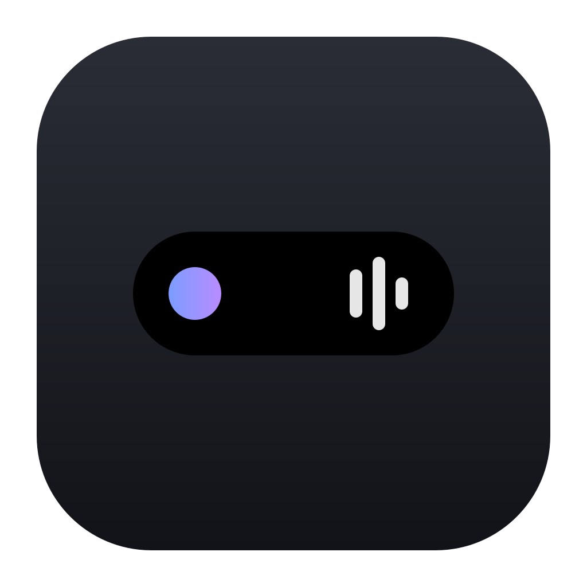

# Island

**Dynamic Island for Windows**

<b>English</b> · click to read in English

 

A liquid black pill at the top of your screen that shows what is happening right now 
and opens into a toolbox when you reach for it.

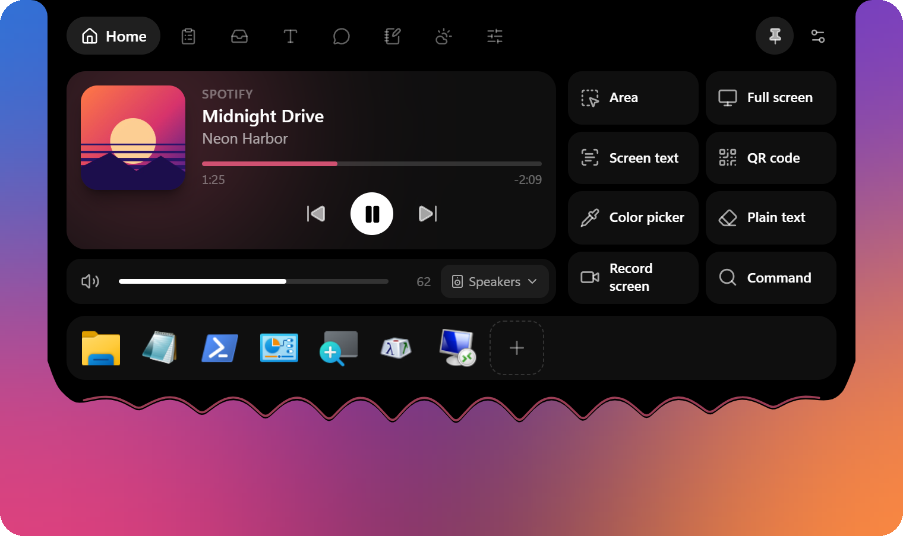

## What it is

Island sits on top of every window, in the middle of the top edge. Collapsed, it is a small pill that
tells you about music, downloads, the microphone, a screen recording. Rest the cursor on it, or push
the cursor against the top edge, and it opens into a panel: clipboard history, a file shelf, text tools,
an AI chat, screenshots, a command bar.

It never takes the keyboard focus away from the window you are typing in, so a click on a clipboard
entry pastes it right where the caret is.

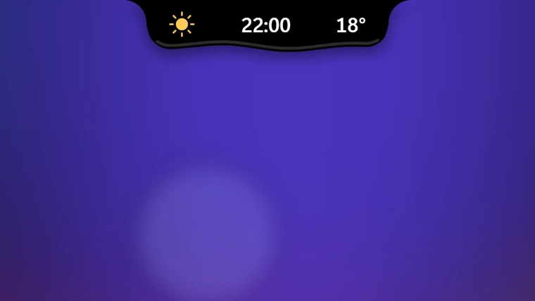

## The pill is alive

The island itself is made of ferrofluid. Its lower edge reaches for the cursor, spikes to the music in
the colour of the album cover, drops a bead when something good happens and sags when you are away.

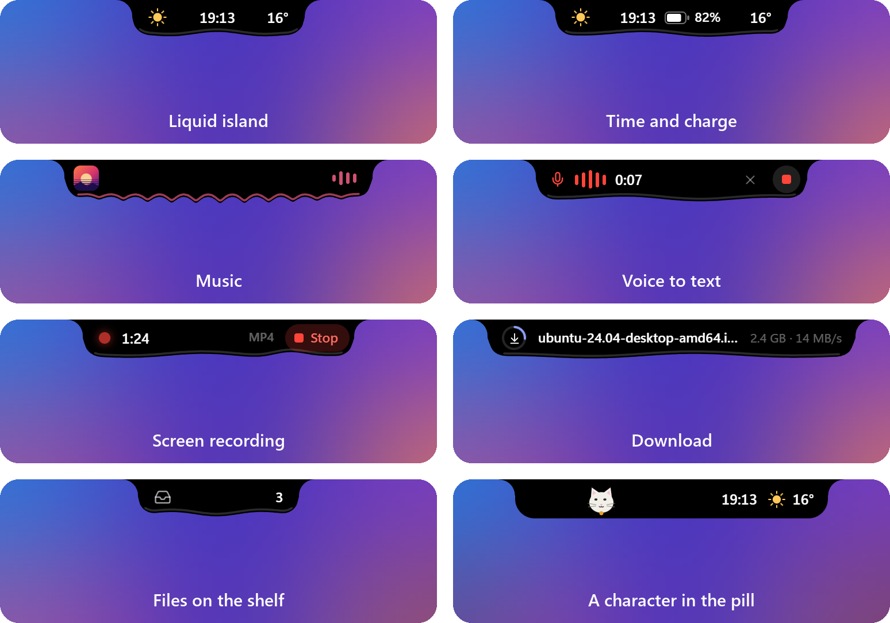

Events show up on their own and fold away a moment later:

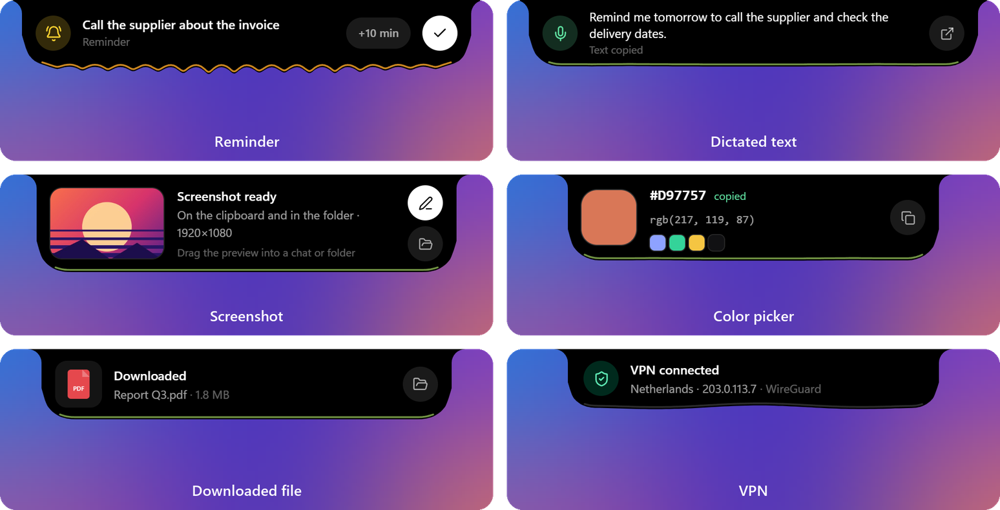

Music with an equalizer · dictation with a voice meter · reminders · downloads from any app · microphone and
camera dots with a mute button · volume by mouse wheel · keyboard layout and Caps Lock · VPN with country
and IP · screen recording · updates.

The time sits in the middle of the folded island, with the battery charge next to it on a laptop. And if
the island gets in the way of your browser's tabs, turn on auto-hide: it leaves the screen and comes back
when the cursor rests at the very top edge above it.

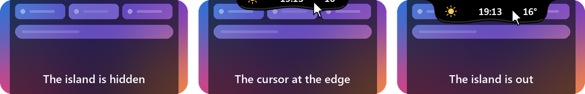

## Pick a character

Liquid island is the default. If you want company, 25 characters live in **Settings → Character**, each with a
live preview: Pixel, a tail, an island on legs, a jellyfish, a hamster wheel, a campfire, a lens, Newton's
cradle and more. They react to music, to the AI thinking, to finished actions and alarms, their eyes follow
the real cursor, and they fall asleep when you are away. Pixel, Spark and Eyes are free; the others come
with [Island Pro](#island-pro).

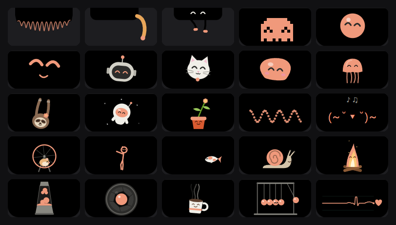

## Weather

A forecast tab: the weather now over a sky that matches it, the next 24 hours and a week ahead. The
temperature also sits on the folded island while nothing else is going on there, and a card warns you about
an hour before rain or snow starts. When it rains outside, the liquid island drips a little.

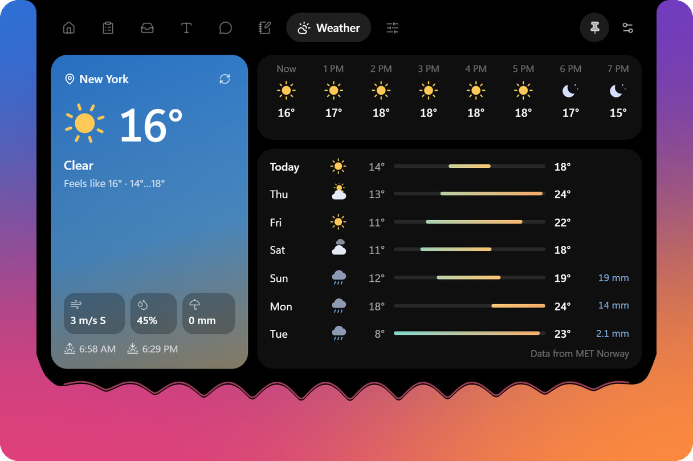

The forecast comes from [MET Norway](https://www.met.no/en) with no key and no sign-up. You choose the city
once by name; it is never guessed from your network address. The weather is part of [Island Pro](#island-pro).

## Inside

<table>
<tr>
<td width="50%" valign="top">
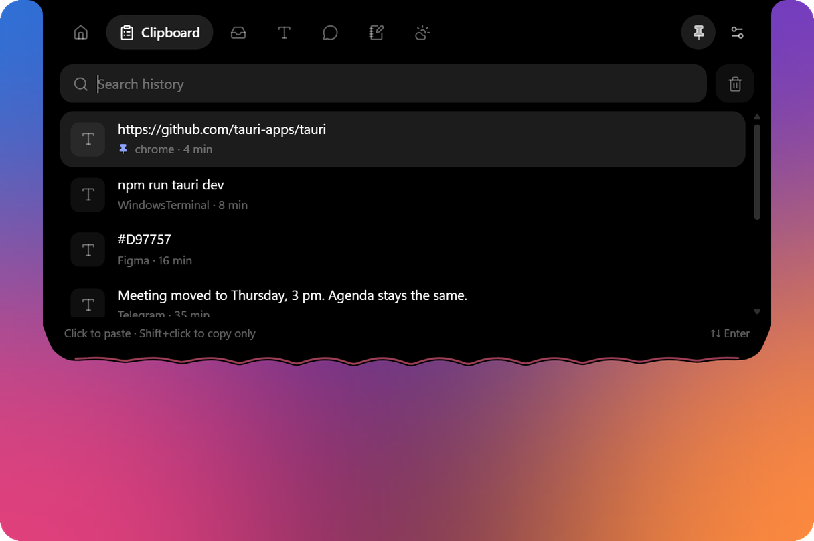
<b>Clipboard.</b> History of text and images with search and pins. A click pastes the entry into the window you were typing in.
</td>
<td width="50%" valign="top">
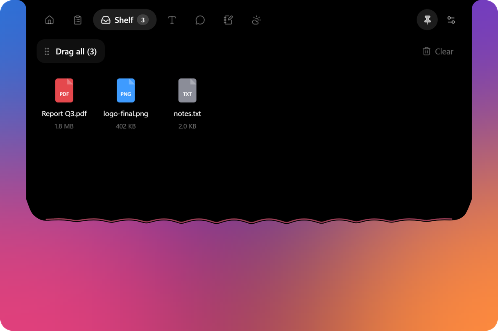
<b>Shelf.</b> Drop files on the island and they wait there until you drag them into the right window, one by one or all at once.
</td>
</tr>
<tr>
<td valign="top">
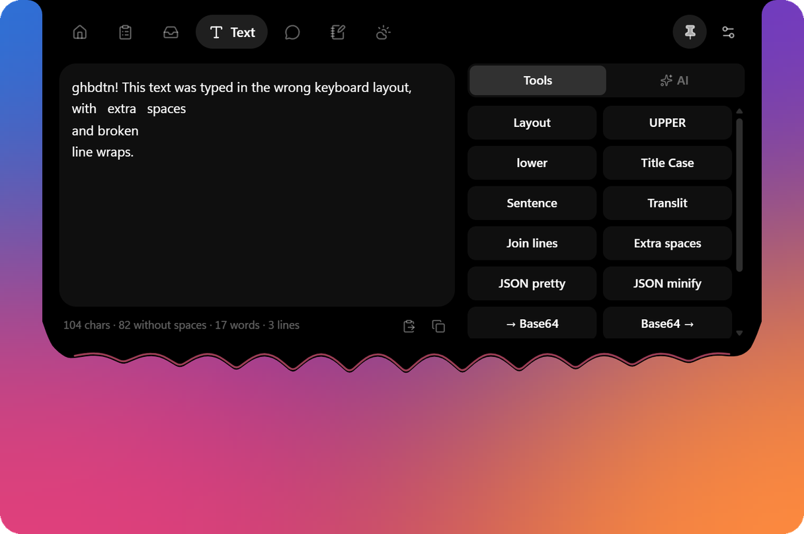
<b>Text.</b> Wrong keyboard layout, cases, transliteration, JSON, Base64, URL, QR codes, plus AI actions: translate, fix, shorten, explain, reply.
</td>
<td valign="top">
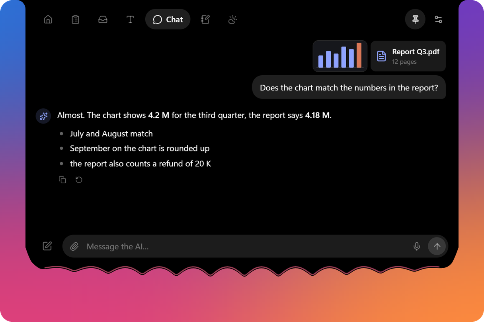
<b>Chat.</b> A conversation with an AI that remembers the context. Attach pictures and documents (PDF, Word, Excel, PowerPoint, text): paste, drop or pick them, then ask. Dictate the message with the microphone button.
</td>
</tr>
<tr>
<td valign="top">
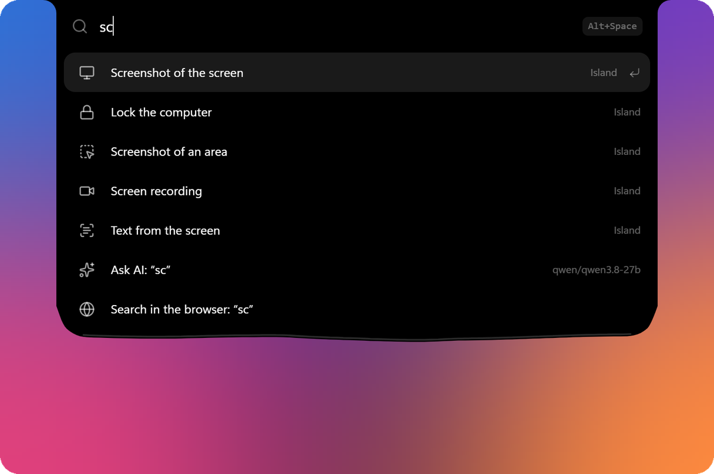
<b>Command bar.</b> Apps, recent files, a calculator, unit and currency conversion, web search, a question to the AI. <code>Alt+Space</code>.
</td>
<td valign="top">
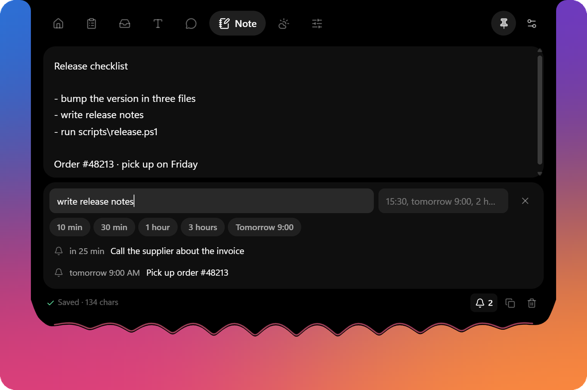
<b>Note.</b> One note that saves itself, with reminders: pick a line, choose “in 30 min” or type “tomorrow 9:00”, and the island will call you at that time.
</td>
</tr>
<tr>
<td valign="top">
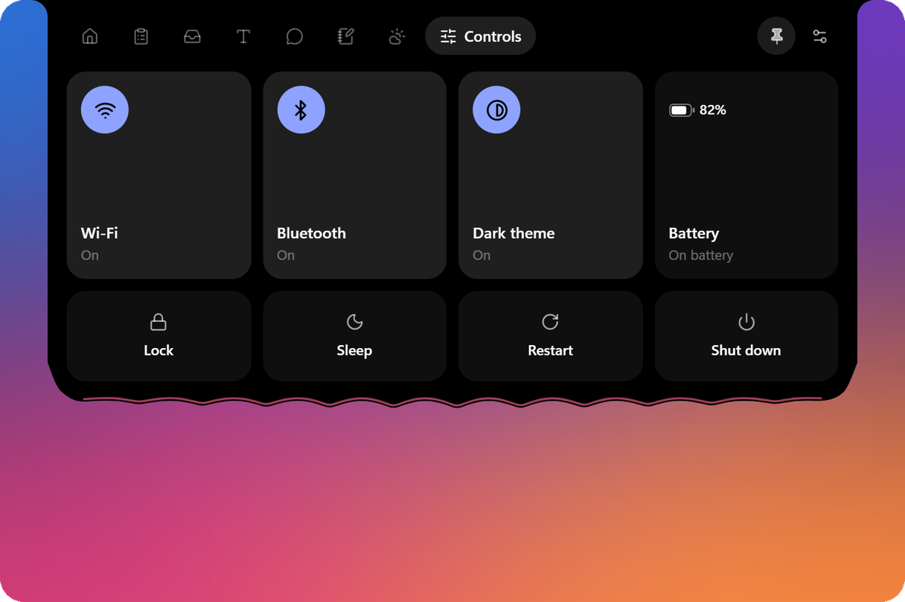
<b>Controls.</b> Wi-Fi, Bluetooth and the dark theme in one press; lock, sleep, restart and shut down. The last three ask to be pressed twice.
</td>
<td valign="top">
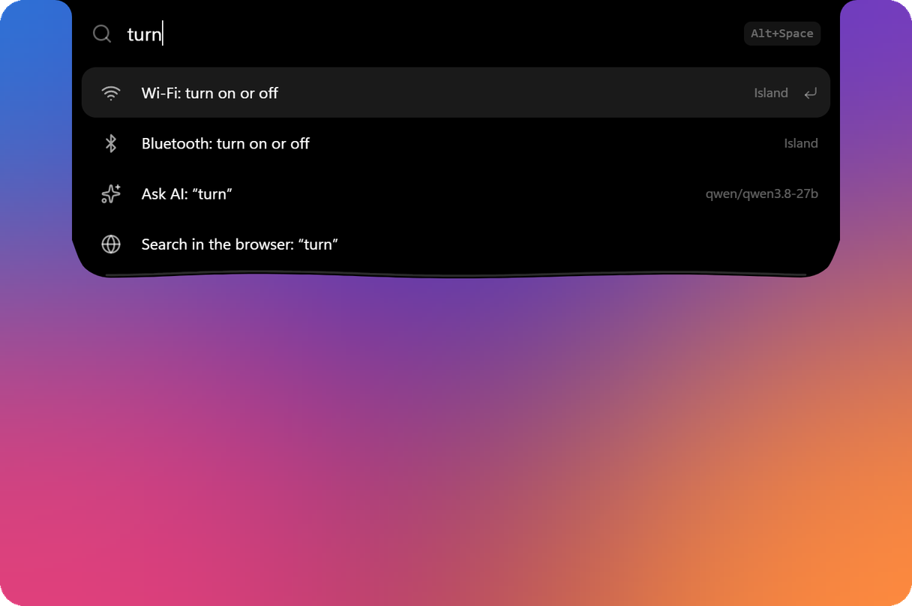
<b>System commands.</b> The same from the command bar: “wifi”, “bluetooth”, “theme”, “lock”.
</td>
</tr>
</table>

### Tools

- **Screenshots** of an area or the whole screen, to the clipboard and to a folder, with markup: arrows, boxes, a marker, text, blur for private data.
- **Text from the screen (OCR).** Windows' Russian and English recognizers are merged line by line.
- **QR code from the screen** and a **color picker** with a magnifier and colour history.
- **Screen recording** to MP4 (H.264 through Media Foundation) or GIF.
- **Paste without formatting** on a hotkey.
- **Transparency** of the folded and of the open island, each set on its own.
- **Voice to text.** Press the hotkey, speak, press again: the text is on the clipboard (and, if you like, typed straight into the window you were in).
- **Reminders** that show up as a card with a sound and wait until you answer them.
- **AI** through any OpenAI-compatible API, with free services one click away.
- **Two languages.** Russian on Russian-speaking systems, English everywhere else; switch in Settings at any time.

Text from the screen, screen recording, voice to text and the AI are part of [Island Pro](#island-pro);
everything else here is free.

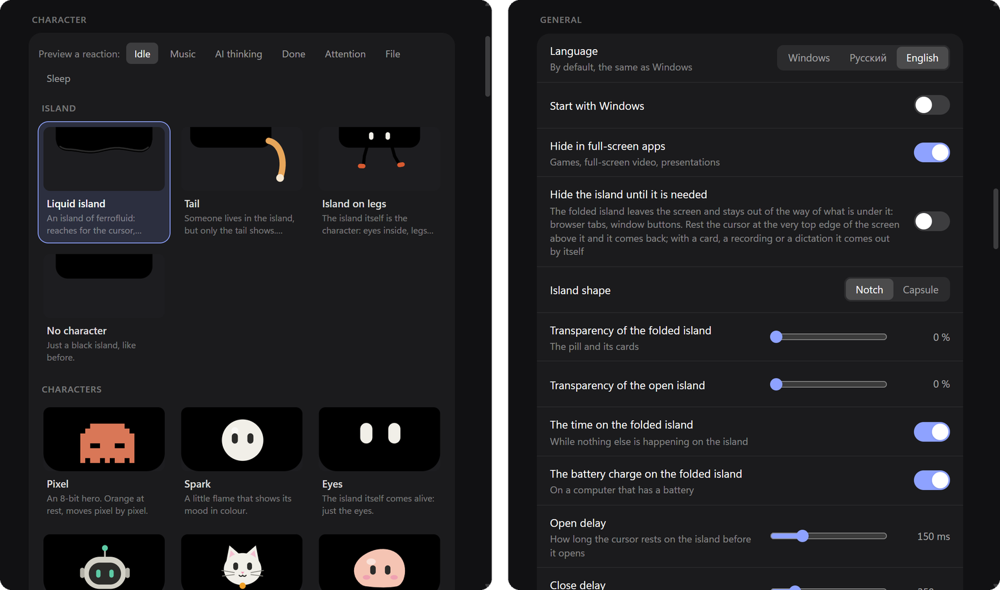

### Hotkeys

All of them can be changed in Settings.

| | |
|---|---|
| `Ctrl+Alt+I` | open or close the island |
| `Alt+Space` | command bar |
| `Ctrl+Alt+A` | AI chat |
| `Ctrl+Alt+D` | voice to text: start and finish |
| `Ctrl+Alt+V` | clipboard history |
| `Ctrl+Alt+S` / `Ctrl+Alt+Shift+S` | screenshot of an area / of the screen |
| `Ctrl+Alt+O` | text from the screen |
| `Ctrl+Alt+Q` | QR code from the screen |
| `Ctrl+Alt+C` | color picker |
| `Ctrl+Alt+R` | screen recording: start and stop |
| `Ctrl+Alt+Shift+V` | paste without formatting |
| `Ctrl+Alt+M` | microphone: mute and unmute |

## Island Pro

Island is free, and most of it stays free for good: the live pill, clipboard history, the shelf, text
tools, the note with reminders, screenshots with markup, QR codes, the color picker, the command bar, the
liquid island and three characters (Pixel, Spark and Eyes).

**Island Pro** is bought once and adds the rest:

- the other 22 characters;
- the weather: the forecast tab, the temperature on the island, warnings about rain and snow;
- the AI (the chat, text actions, a question from the command bar) and voice to text, both with your own key from an AI service, free ones included;
- screen recording and text from the screen.

For the first 14 days all of Pro is open, so you can try everything before you decide. After that the
free part keeps working, and nothing you saved is lost.

The key costs **$2.99**, never expires, is checked on your computer with no internet and works on all of
your own computers.

**[Buy Island Pro](https://app.lava.top/products/53729bb9-e57e-4ee3-b141-9344ad806f01?currency=USD)**, then paste the key into **Settings → Island Pro**.
Visa, Mastercard, Apple Pay and PayPal are accepted.

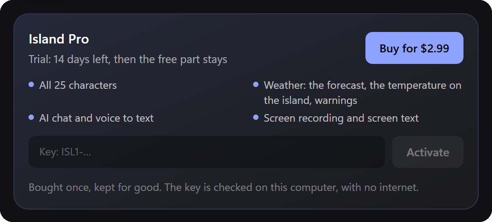

## Install

Download the latest `Island_x.y.z_x64-setup.exe` from
[**Releases**](https://github.com/exuupery/island/releases/latest) and run it.
Windows 10 or 11, 64-bit.

Island updates itself: it checks for a new version at startup and every 6 hours, shows an “Update” card,
downloads the signed installer and restarts.

### AI

Island ships without any key: you bring your own, and it stays on your computer. **Settings → AI** has
ready-made services, so it takes a minute and can cost nothing:

| Service | Free tier | Pictures | Dictation with the same key |
|---|---|---|---|
| [Groq](https://console.groq.com/keys) | about 1000 requests a day, no card | yes, up to three per message | yes: Whisper, up to 8 hours of speech a day |
| [Google Gemini](https://aistudio.google.com/apikey) | free tier of AI Studio | yes | yes |
| [OpenRouter](https://openrouter.ai/keys) | 50 requests a day on free models | yes | no |

Pick one, press “Get a key”, paste the key, press “Test”. Any other OpenAI-compatible address works too.
These three services do not answer requests from Russia; there they need a VPN.

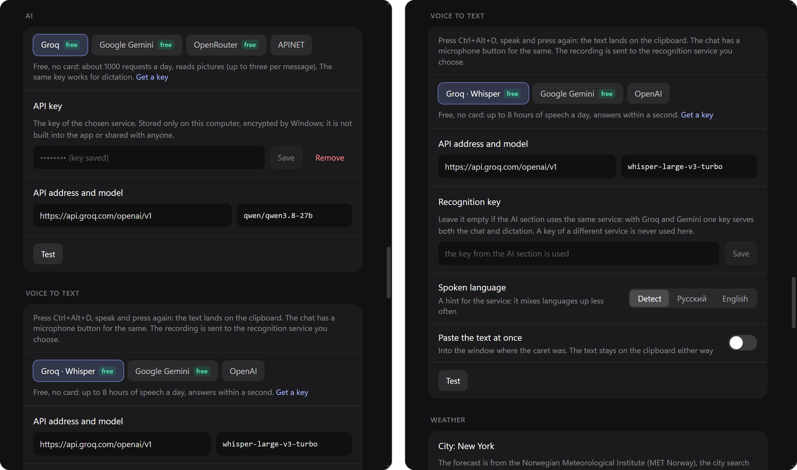

The AI lives in three places: the buttons on the Text tab, a question from the command bar (`Tab`), and the
Chat tab. An answer from the command bar continues in the chat with `Ctrl+Enter`.

In the chat, pictures are scaled down and sent to the model as images; documents are read on your computer
and sent as text (a scanned PDF has no text: attach a screenshot of the page instead).

## Privacy

Island works on your computer and keeps its data there.

- Clipboard history, the shelf, the note and the chat are stored in a local SQLite database. Copies from password managers that mark them as private are never recorded; you can add your own list of apps to skip.
- Keys are encrypted by Windows (DPAPI) for the current user and leave the computer only in requests to the service they were issued for. No key is built into the app.
- The Island Pro key is checked on your computer and is not sent anywhere.
- What you dictate and what you attach in the chat goes to the service you chose, and nowhere else. A recording is not kept after it is recognised.
- Network requests, all of them optional or obvious: the AI endpoint you set up, the update check on GitHub, the forecast for the city you chose (api.met.no; only its coordinates are sent), the city search when you look one up (nominatim.openstreetmap.org; what you typed), Bank of Russia exchange rates for the currency converter (cbr-xml-daily.ru), and a country/IP lookup for the VPN chip (ipwho.is; can be switched off).
- The island and the selection overlay are excluded from screen capture, so they never end up in your screenshots.

## Limitations

- Paste on click does not work in windows running as administrator (Windows protects them). The entry still lands on the clipboard.
- Nothing can be drawn over games in exclusive full-screen mode, so the island hides there.
- Screen recording has no sound.
- Windows only.

## Data

The forecast is from [MET Norway](https://www.met.no/en) (CC BY 4.0), the city search from [OpenStreetMap](https://www.openstreetmap.org/copyright) contributors (ODbL), time zones from [GeoNames](https://www.geonames.org/) (CC BY 4.0).

<b>Русский</b>

 

Жидкая чёрная пилюля вверху экрана: показывает, что происходит прямо сейчас, 
и раскрывается в набор инструментов, когда к ней тянешься.

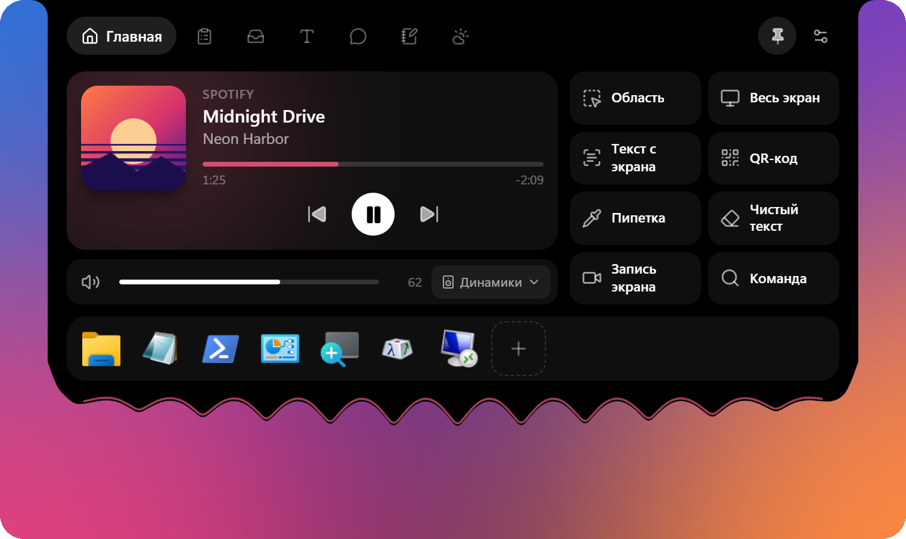

## Что это

Island висит поверх всех окон, по центру верхнего края. В свёрнутом виде это маленькая пилюля, которая
сообщает о музыке, загрузках, микрофоне, записи экрана. Задержи на ней курсор или упрись им в верхний
край, и она раскроется в панель: история буфера, полка для файлов, инструменты для текста, чат с ИИ,
скриншоты, командная строка.

Остров не забирает фокус у окна, в котором ты печатаешь. Поэтому клик по записи из буфера вставляет её
ровно туда, где стоит курсор.

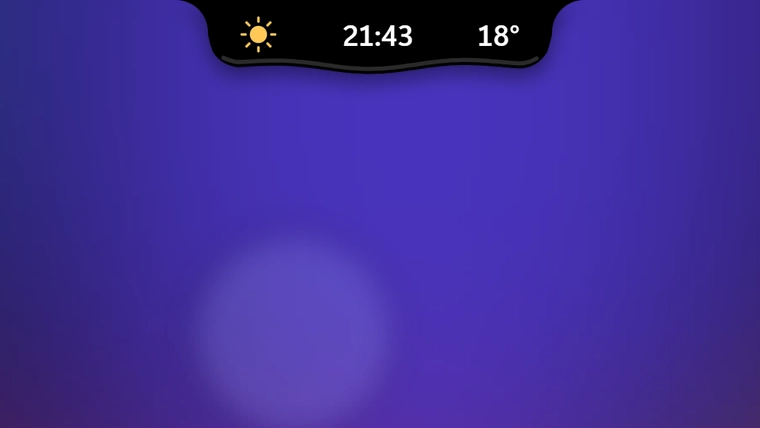

## Пилюля живая

Сам остров сделан из магнитной жидкости. Нижний край тянется к курсору, под музыку идёт шипами в цвет
обложки, от хороших новостей роняет каплю, а когда тебя нет, устало провисает.

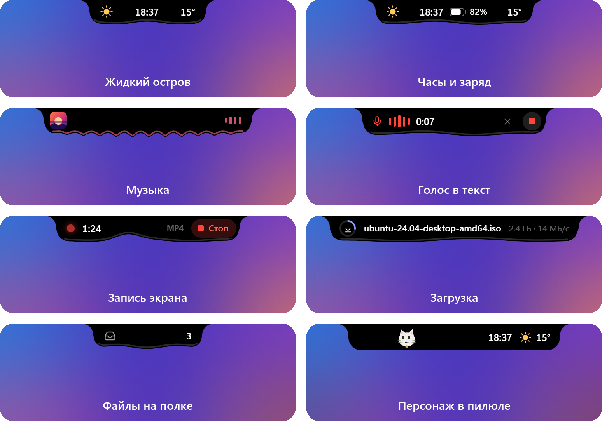

События появляются сами и через мгновение сворачиваются:

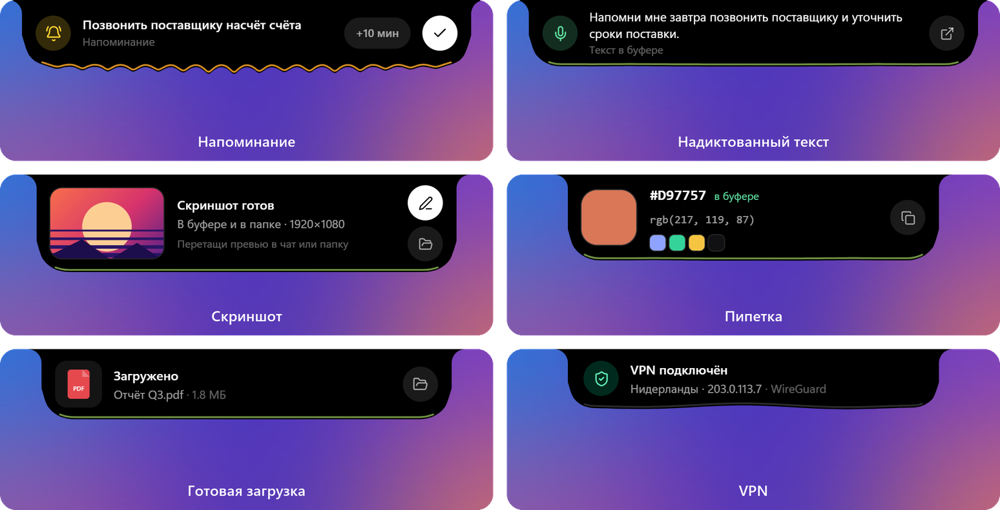

Музыка с эквалайзером · диктовка с индикатором голоса · напоминания · загрузки из любых программ · точки
микрофона и камеры с кнопкой отключения · громкость колесом мыши · раскладка и Caps Lock · VPN со страной
и IP · запись экрана · обновления.

Посередине свёрнутого острова стоит время, на ноутбуке рядом с ним заряд батареи. А если остров закрывает
вкладки браузера, включи автоскрытие: он уйдёт за край экрана и вернётся, когда задержишь курсор у самого
верхнего края над ним.

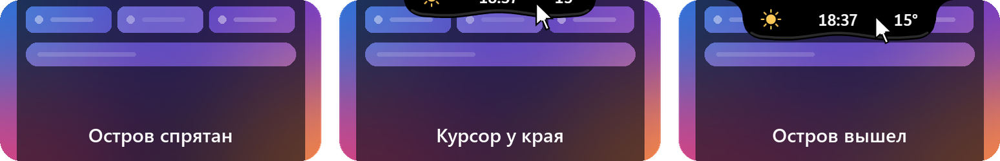

## Выбери персонажа

По умолчанию стоит жидкий остров. Если хочется компании, в разделе **Настройки → «Персонаж»** живут
25 персонажей, каждый с живым превью: Пиксель, хвост, остров на ножках, медуза, хомяк в колесе, костёр,
объектив, маятник Ньютона и другие. Они реагируют на музыку, на размышления ИИ, на готовые действия и
тревогу, следят глазами за настоящим курсором и засыпают, когда тебя нет. Пиксель, Искра и Глазки
бесплатные, остальные входят в [Island Pro](#island-pro-1).

## Погода

Вкладка с прогнозом: погода сейчас на фоне неба, которое ей соответствует, ближайшие 24 часа и неделя
вперёд. Температура видна и на свёрнутом острове, пока на нём больше ничего не происходит, а примерно за час
до дождя или снега появляется карточка-предупреждение. Когда на улице дождь, жидкий остров слегка капает.

Прогноз берётся у [MET Norway](https://www.met.no/en) без ключа и регистрации. Город выбирается один раз по
названию; по адресу в сети он не определяется. Погода входит в [Island Pro](#island-pro-1).

## Что внутри

<table>
<tr>
<td width="50%" valign="top">
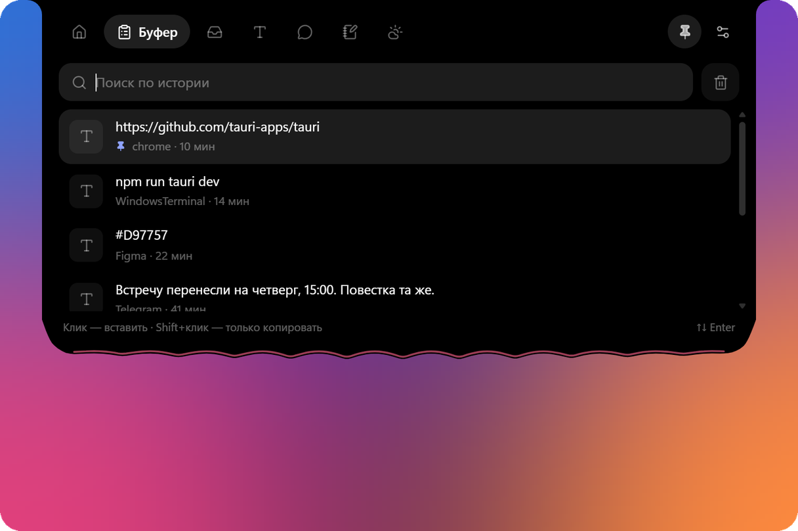
<b>Буфер.</b> История текста и картинок с поиском и закреплением. Клик вставляет запись в окно, где ты печатал.
</td>
<td width="50%" valign="top">
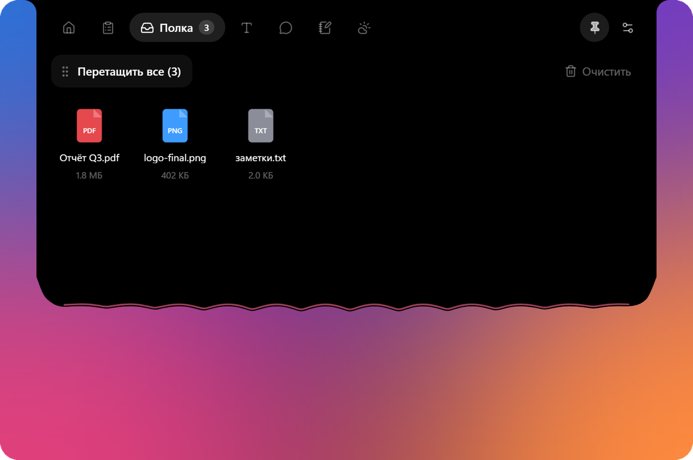
<b>Полка.</b> Брось файлы на остров, и они подождут там, пока ты не вытащишь их в нужное окно: по одному или все сразу.
</td>
</tr>
<tr>
<td valign="top">
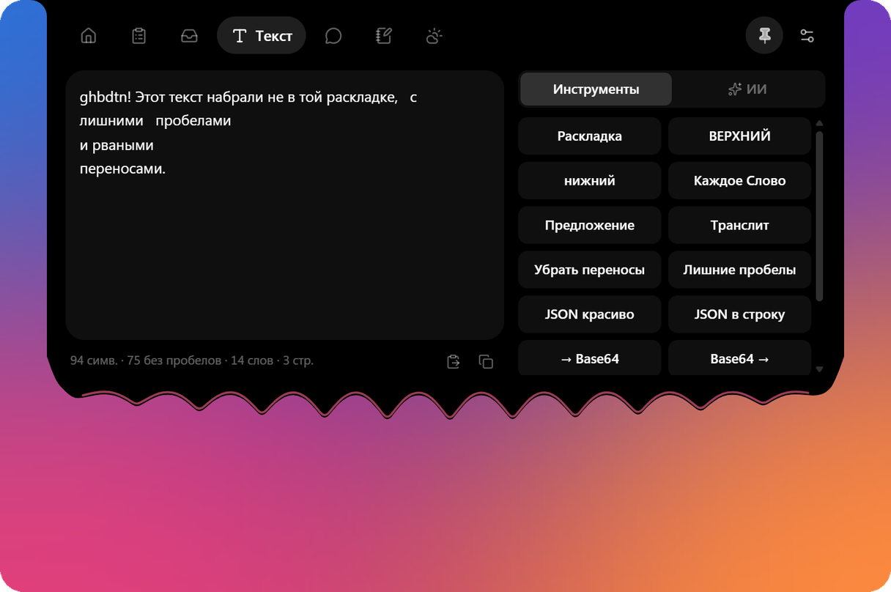
<b>Текст.</b> Не та раскладка, регистры, транслит, JSON, Base64, URL, QR-коды и действия ИИ: перевести, исправить, сократить, объяснить, ответить.
</td>
<td valign="top">
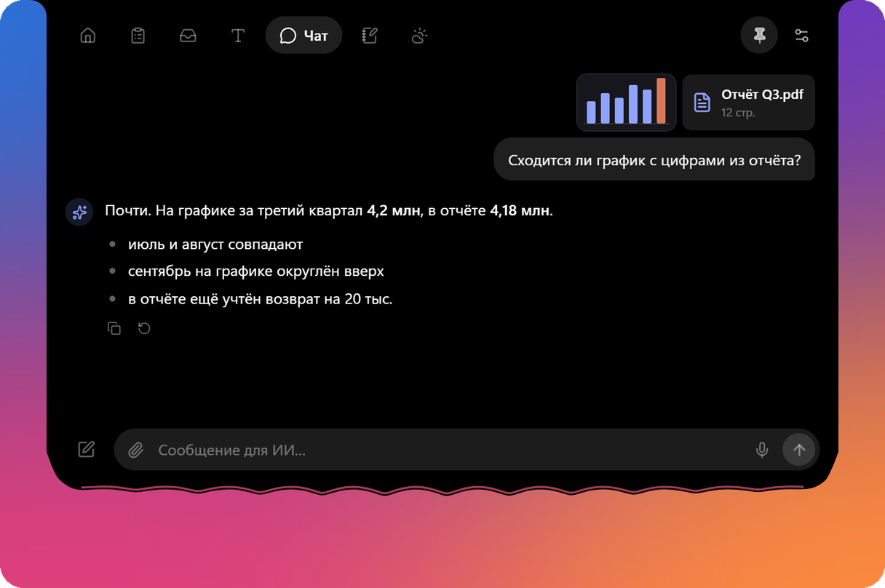
<b>Чат.</b> Диалог с ИИ, который помнит контекст. К сообщению можно приложить картинки и документы (PDF, Word, Excel, PowerPoint, текст): вставь, перетащи или выбери, а потом спрашивай. Сообщение можно надиктовать кнопкой с микрофоном.
</td>
</tr>
<tr>
<td valign="top">
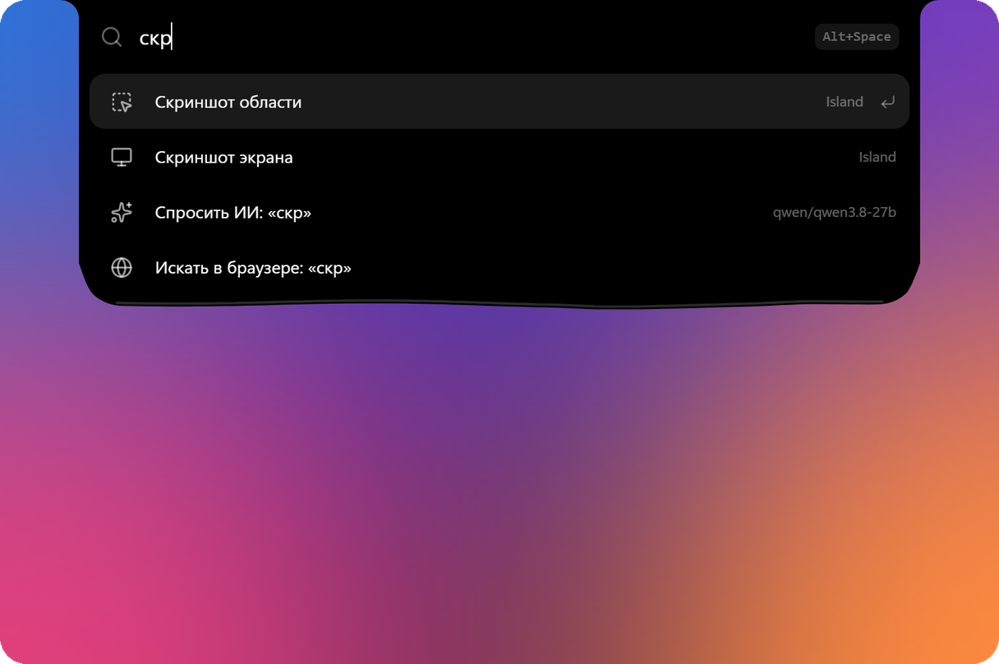
<b>Командная строка.</b> Программы, недавние файлы, калькулятор, перевод единиц и валют, поиск в интернете, вопрос ИИ. <code>Alt+Space</code>.
</td>
<td valign="top">
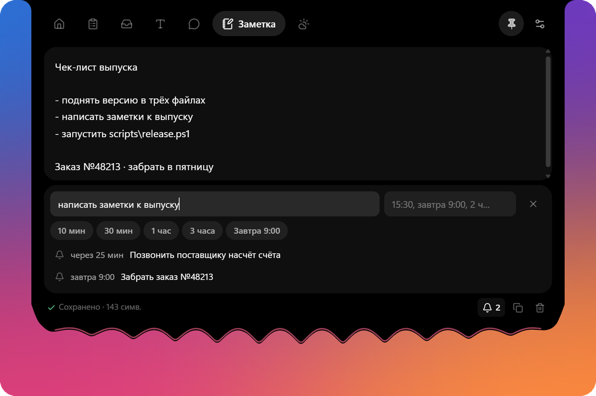
<b>Заметка.</b> Одна заметка, которая сохраняется сама, и напоминания к ней: встань на строку, выбери «30 мин» или напиши «завтра 9:00», и остров позовёт тебя в это время.
</td>
</tr>
<tr>
<td valign="top">
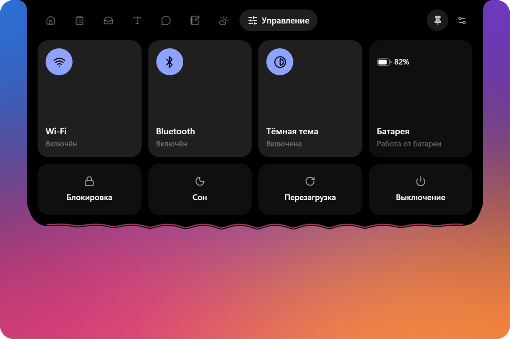
<b>Управление.</b> Wi-Fi, Bluetooth и тёмная тема одним нажатием; блокировка, сон, перезагрузка и выключение. Три последних просят нажать дважды.
</td>
<td valign="top">
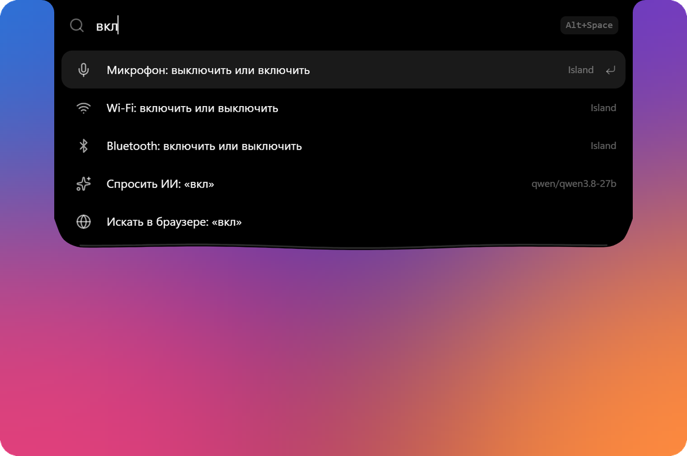
<b>Команды системы.</b> То же самое из командной строки: «wifi», «bluetooth», «тема», «заблокировать».
</td>
</tr>
</table>

### Инструменты

- **Скриншоты** области и всего экрана, в буфер и в папку, с разметкой: стрелки, рамки, маркер, текст, размытие личных данных.
- **Текст с экрана (OCR).** Русский и английский распознаватели Windows склеиваются построчно.
- **QR-код с экрана** и **пипетка** с лупой и историей цветов.
- **Запись экрана** в MP4 (H.264 через Media Foundation) или GIF.
- **Вставка без форматирования** по горячей клавише.
- **Прозрачность** свёрнутого и раскрытого острова настраивается отдельно.
- **Голос в текст.** Нажми сочетание, скажи, нажми ещё раз: текст в буфере (а если хочешь, сразу в окне, где стоял курсор).
- **Напоминания**: появляются карточкой со звуком и ждут, пока на них не ответят.
- **ИИ** через любой OpenAI-совместимый API; бесплатные сервисы подключаются в один клик.
- **Два языка.** Русский на русскоязычных системах, английский на остальных; переключается в настройках в любой момент.

Текст с экрана, запись экрана, голос в текст и ИИ входят в [Island Pro](#island-pro-1); всё остальное
здесь бесплатно.

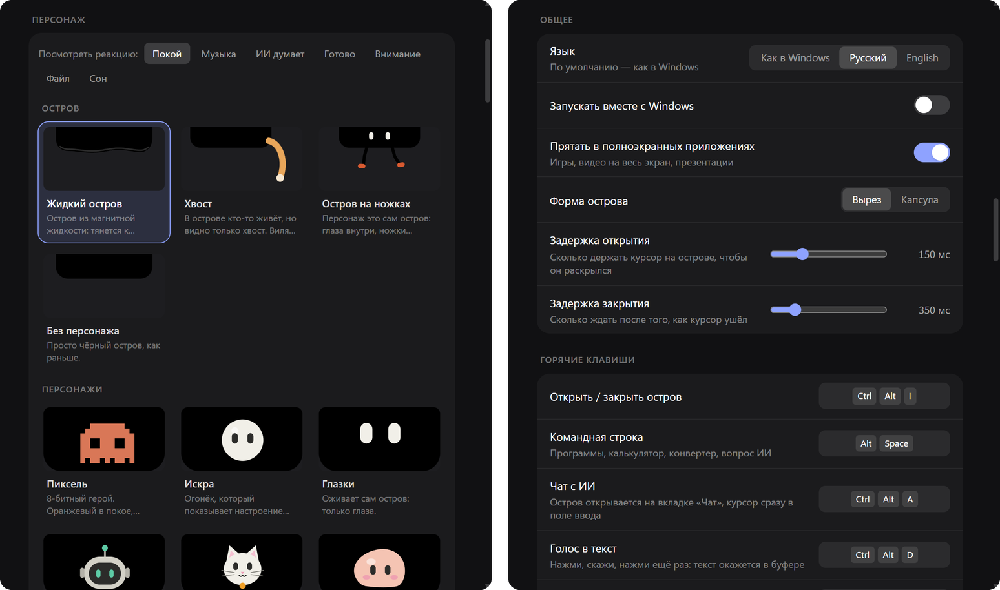

### Горячие клавиши

Все меняются в настройках.

| | |
|---|---|
| `Ctrl+Alt+I` | открыть или закрыть остров |
| `Alt+Space` | командная строка |
| `Ctrl+Alt+A` | чат с ИИ |
| `Ctrl+Alt+D` | голос в текст: начать и закончить |
| `Ctrl+Alt+V` | история буфера |
| `Ctrl+Alt+S` / `Ctrl+Alt+Shift+S` | скриншот области / экрана |
| `Ctrl+Alt+O` | текст с экрана |
| `Ctrl+Alt+Q` | QR-код с экрана |
| `Ctrl+Alt+C` | пипетка |
| `Ctrl+Alt+R` | запись экрана: начать и остановить |
| `Ctrl+Alt+Shift+V` | вставить без форматирования |
| `Ctrl+Alt+M` | микрофон: выключить и включить |

## Island Pro

Island бесплатный, и большая его часть остаётся бесплатной навсегда: живая пилюля, история буфера,
полка, инструменты для текста, заметка с напоминаниями, скриншоты с разметкой, QR-коды, пипетка,
командная строка, жидкий остров и три персонажа (Пиксель, Искра и Глазки).

**Island Pro** покупается один раз и добавляет остальное:

- остальных 22 персонажей;
- погоду: вкладку с прогнозом, температуру на острове, предупреждения о дожде и снеге;
- ИИ (чат, действия с текстом, вопрос из командной строки) и голос в текст — со своим ключом сервиса ИИ, в том числе бесплатного;
- запись экрана и текст с экрана.

Первые 14 дней весь Pro открыт, так что всё можно попробовать до покупки. Потом бесплатная часть
продолжает работать, и ничего из сохранённого не пропадает.

Ключ стоит **249 ₽**, бессрочный, проверяется на твоём компьютере без интернета и подходит для всех
своих компьютеров.

**[Купить Island Pro](https://app.lava.top/products/53729bb9-e57e-4ee3-b141-9344ad806f01?currency=RUB)**, потом вставь ключ в **Настройки → Island Pro**.
Оплата картой или через СБП.

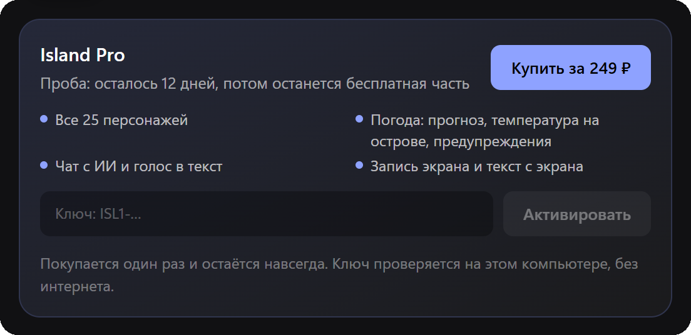

## Установка

Скачай свежий `Island_x.y.z_x64-setup.exe` из
[**Releases**](https://github.com/exuupery/island/releases/latest) и запусти.
Нужна Windows 10 или 11, 64-разрядная.

Island обновляется сам: проверяет новую версию при запуске и раз в 6 часов, показывает карточку
«Обновить», скачивает подписанный установщик и перезапускается.

### ИИ

В Island не вшит ни один ключ: каждый подключает свой, и он остаётся на его компьютере. В разделе
**Настройки → «ИИ»** есть готовые сервисы, так что это занимает минуту и может ничего не стоить:

| Сервис | Бесплатно | Картинки | Диктовка тем же ключом |
|---|---|---|---|
| [Groq](https://console.groq.com/keys) | около 1000 запросов в день, без карты | да, до трёх в сообщении | да: Whisper, до 8 часов речи в день |
| [Google Gemini](https://aistudio.google.com/apikey) | бесплатный тариф AI Studio | да | да |
| [OpenRouter](https://openrouter.ai/keys) | 50 запросов в день на бесплатных моделях | да | нет |
| APINET | платно, в рублях | да | — |

Выбери сервис, нажми «Получить ключ», вставь ключ, нажми «Проверить». Подойдёт и любой другой
OpenAI-совместимый адрес. Groq, Gemini и OpenRouter не отвечают на запросы из России: с ними нужен VPN.
APINET работает без него.

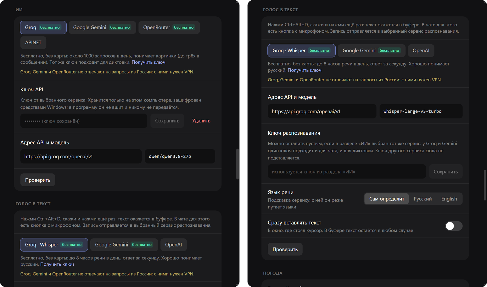

ИИ работает в трёх местах: кнопки на вкладке «Текст», вопрос из командной строки (`Tab`) и вкладка «Чат».
Ответ из командной строки продолжается в чате по `Ctrl+Enter`.

В чате картинки уменьшаются и уходят модели как изображения; документы читаются на твоём компьютере и
уходят текстом (в отсканированном PDF текста нет: приложи вместо него снимок страницы).

## Приватность

Island работает на твоём компьютере и хранит данные там же.

- История буфера, полка, заметка и чат лежат в локальной базе SQLite. Копии из менеджеров паролей, которые помечают их как приватные, не записываются никогда; свой список программ-исключений можно добавить в настройках.
- Ключи шифруются Windows (DPAPI) для текущего пользователя и покидают компьютер только в запросах к тому сервису, для которого выданы. В программу не вшит ни один ключ.
- Ключ Island Pro проверяется на твоём компьютере и никуда не отправляется.
- То, что ты диктуешь и прикладываешь в чате, уходит в выбранный тобой сервис и больше никуда. Запись голоса после распознавания не хранится.
- Сетевые запросы, все необязательные или очевидные: настроенный тобой адрес ИИ, проверка обновлений на GitHub, прогноз для выбранного города (api.met.no; уходят только его координаты), поиск города, когда ты его ищешь (nominatim.openstreetmap.org; уходит набранное название), курсы ЦБ для конвертера валют (cbr-xml-daily.ru) и определение страны и IP для значка VPN (ipwho.is; отключается).
- Остров и окно выделения исключены из захвата экрана, поэтому не попадают на твои скриншоты.

## Ограничения

- Вставка кликом не работает в окнах, запущенных от администратора (защита Windows). Запись при этом остаётся в буфере.
- Над играми в эксклюзивном полноэкранном режиме ничего не рисуется, поэтому остров там прячется.
- Запись экрана без звука.
- Только Windows.

## Данные

Прогноз — [MET Norway](https://www.met.no/en) (CC BY 4.0), поиск городов — участники [OpenStreetMap](https://www.openstreetmap.org/copyright) (ODbL), часовые пояса — [GeoNames](https://www.geonames.org/) (CC BY 4.0).

